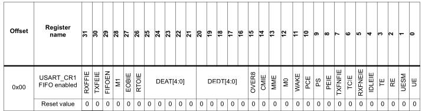
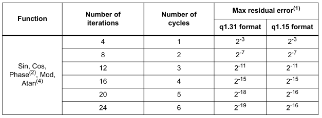
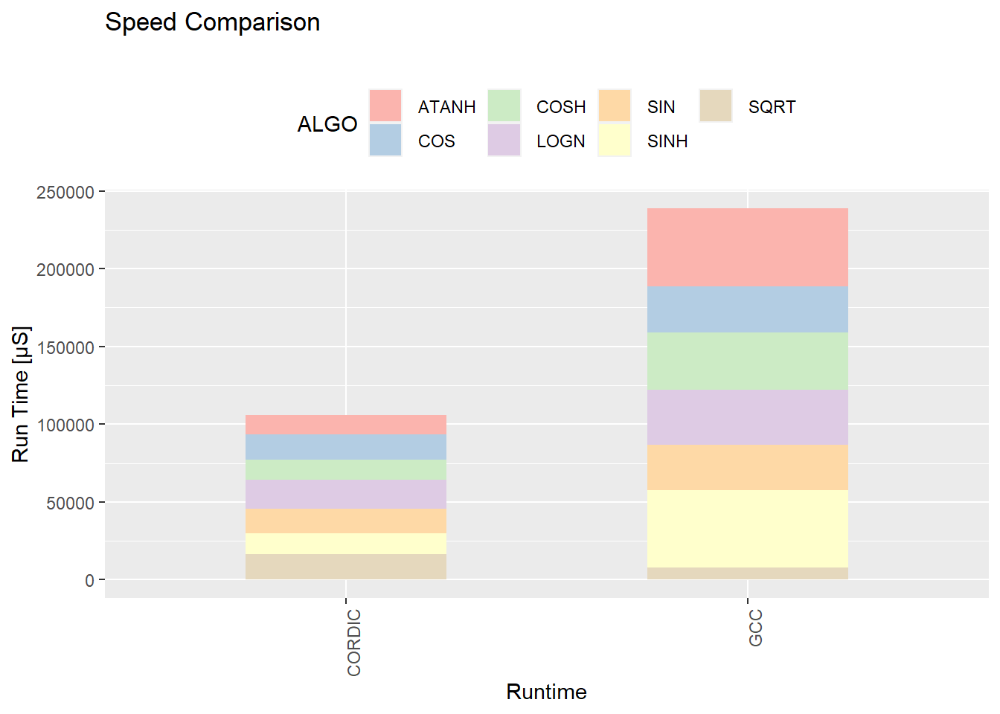

# Einleitung

Die Programmierung mit Mikrocontrollern wird immer anspruchsvoller, da diese immer mehr Komponenten erhalten.
Gleichzeitig hat sich dieser Bereich der Softwareentwicklung kaum weiterentwickelt, sodass Mikrocontroller weiterhin so programmiert werden,
wie es üblich war zu der Zeit, als diese wesentlich weniger komplex waren. C++ mit seinen Zero-Cost Abstractions bietet daher eine sehr gute Möglichkeit,
bestimmte Konzepte zu abstrahieren und somit die Entwicklung für Mikrocontroller nicht nur einfacher, sondern auch sicherer, zu gestalten.
Beispielhaft wurde ein Framework für die Verwendung von mehreren Komponenten für einen Mikrocontroller der STM32-Reihe entwickelt. 
Dabei sollen zwei Komponenten des Mikrocontrollers mit den Mitteln von C++ modelliert werden.
Dafür werden zunächst die dem Framework zugrunde liegenden Konzepte gezeigt, um dann die Komponenten als solche zu implementieren.
Die zweite Komponente, eine sogenannte CORDIC-Einheit, ist eine spezielle Einheit innerhalb des hier verwendeten Modells des STM32.
Dieser kann einige trigonometrische Funktionen berechnen, die Performance soll dann mit den äquivalenten, eingebauten Funktionen verglichen werden.

# Die Ansteuerung der Peripherie

Oftmals wird die Peripherie von Mikrocontrollern, sowie bei dem vorliegenden STM32G4 über das Setzen von Bits in Registern, gesteuert.
Die Register befinden sich an bestimmten Stellen im Speicher des Mikrocontrollers.
Für das Setzen von Bits würde es genügen einen Pointer mit dem richtigen Typ auf diesen Bereich zeigen zu lassen und dann die jeweils benötigten Bits zu setzen.
Eines der Ziele ist es jedoch neben der Typsicherheit eine Resistenz gegen Fehlverwendung herzustellen.
Mit dem Zeiger eines primitiven Datentypes auf das Register, können unsinnige Werte gesetzt werden, weiterhin gibt es oftmals in
Registern Werte und Teile, die nicht manipuliert werden dürfen.
Um diese beiden Ziele zu erreichen wurden eigene Datentypen implementiert, diese werden im nachfolgenden Abschnitt näher erläutert.

## Beschreibung eines Registers

In der folgenden Abbildung ist die Beschreibung eines Registers des Mikrocontrollers abgebildet, wie sie in der Dokumentation des STM32G4 Mikrocontrollers vorkommt.
Die Beschreibung einzelner Bits besteht aus einer Funktion, einem Bereich und gültigen Werten.
Weiterhin wird bestimmt, ob es reservierte Bereiche gibt, welche nicht verändert werden dürfen.
Diese Zusammenhänge wurden in einem Datentyp modelliert.
Dieser Datentyp kann somit als Manifestation des Datenblattes verstanden werden.

~~~cpp
register_entry_desc<CR::DEDT, uint8_t, bit_range<16u, 20u>, access_mode::read_write>
~~~

Dieser Typ beschreibt die Bitpositionen von 16 - 20 einschließlich, auf den Bereich kann lesend und schreibend zugegriffen werden.
Die Funktion des Bereichs wird mit einem enum Eintrag beschrieben. 
So muss jedes einzelne Bit beschrieben werden, ein Konzept stellt dies zur Kompilezeit sicher.
Diese überprüft weiterhin, dass sich die einzelnen Bereiche nicht überdecken, sodass Fehler beim Zugriff auf die einzelnen Bits ausgeschlossen werden können.
Für das UART Register CR ergibt sich damit folgender Typ, dieser spiegelt die Beschreibung in Abbildung \ref{cr1} wieder.

~~~cpp
register_desc<
volatile uint32_t, register_entry_desc<CR::UE, bool, bit_pos<0u>>,
register_entry_desc<CR::UESM, bool, bit_pos<1u>>,
register_entry_desc<CR::RE, bool, bit_pos<2u>>,
register_entry_desc<CR::TE, bool, bit_pos<3u>>,
register_entry_desc<CR::IDLEIE, bool, bit_pos<4u>>,
register_entry_desc<CR::RXNEIE, bool, bit_pos<5u>>,
register_entry_desc<CR::TCIE, bool, bit_pos<6u>>,
register_entry_desc<CR::TXEIE, bool, bit_pos<7u>>,
register_entry_desc<CR::PEIE, bool, bit_pos<8u>>,
register_entry_desc<CR::PS, parity, bit_pos<9u>>,
register_entry_desc<CR::PCE, bool, bit_pos<10u>>,
register_entry_desc<CR::WAKE, bool, bit_pos<11u>>,
register_entry_desc<CR::M0, bool, bit_pos<12u>>,
register_entry_desc<CR::MME, bool, bit_pos<13u>>,
register_entry_desc<CR::CMIE, bool, bit_pos<14u>>,
register_entry_desc<CR::OVER8, bool, bit_pos<15u>>,
register_entry_desc<CR::DEDT, uint8_t, bit_range<16u, 20u>>,
register_entry_desc<CR::DEAT, uint8_t, bit_range<21u, 25u>>,
register_entry_desc<CR::RTOIE, bool, bit_pos<26u>>,
register_entry_desc<CR::EOBIE, bool, bit_pos<27u>>,
register_entry_desc<CR::M1, bool, bit_pos<28u>>,
register_entry_desc<CR::FIFOEN, bool, bit_pos<29u>>,
register_entry_desc<CR::RESERVED, reserved_type, bit_range<30u, 31u>>>
~~~

Auf diese Weise können auch Register modelliert werden, welche Werte akzeptieren, also keine Steuerungsregister sind.
Hier muss ebenfalls jedes einzelne Bit beschrieben werden.

~~~{.cpp}
register_desc<volatile uint32_t, register_entry_desc<0, uint8_t, bit_range<0u, 7u>>,
                          register_entry_desc<1, reserved_type, bit_range<8u, 31u>, access_mode::no_access>>
~~~

Bei diesem Register sind nur die ersten 8 Bits beschreibbar.
Der *reserved_type* ist ein Datentyp, welcher nicht angelegt werden kann, er dient lediglich als Platzhalter.

## Platzierung eines Registers

Wie eingangs erwähnt, befinden sich die Register an bestimmten Stellen im Speicher. 
Damit muss die vorherige gezeigte Beschreibung eines Register korrekt platziert werden.
Oftmals gibt es auch mehrere Register der selben Art, welche nur an anderen Positionen stehen. 
Die Typen können daher mehrmals verwendet werden, um die verschiedenen Instanzen der Register zu bilden.
Dazu braucht man nur noch eine Lösung die Register an die richtigen Stellen im Speicher zu platzieren.

~~~{.cpp}
template<typename Component, auto N>
[[nodiscard]] constexpr inline auto address() {
    return reinterpret_cast<Component*>(Component::template address<N>::value);
}

template<typename Component, typename N>
[[nodiscard]] constexpr inline auto address() {
    return reinterpret_cast<Component*>(Component::template address<N>::value);
}
~~~

Die beiden Methoden werden dann parametrisiert mit der gewünschten Peripherie, hier Component genannt, mit dem entsprechenden Index.
Die Funktion greift dafür auf einen zuvor festgelegten Bereich zu und wandelt diesen in den gewünschten Datentyp um.
In welcher Relation die Register zueinander stehen, wird in structs modelliert, welche den speziellen Mikrocontroller beschreiben.
Wie diese aufgebaut sind wird in nachfolgend erklärt.

## Beschreibung des Mikrocontroller Aufbaus

<!-- TODO: Add Mikrocontroller Beschreibung hier -->

Die Beschreibung eines Mikrocontrollers ist die Anzahl und die Art seiner Komponenten.
Dies kann man mit einem Konzept implementieren, welches so die Peripherien eines Mikrocontrollers erfordern kann.
Diese Konzepts können dann in den einzelnen HAL-Schnittstellen verwendet werden.
So erfordert die GPIO Klasse, dass der Mikrocontroller einen bestimmten Aufbau aufweist.

~~~{.cpp }
    template<typename MCU, typename PIN>
    concept stm_mcu = requires(MCU::GPIO a) {
    typename MCU::GPIO::template address<PIN>;
    requires input_register_type<decltype(a.moder)>;
    requires input_register_type<decltype(a.otyper)>;
    requires input_register_type<decltype(a.ospeedr)>;
    requires input_register_type<decltype(a.pupdr)>;
    requires output_register_type<decltype(a.idr)>;
    requires input_register_type<decltype(a.bssr_set_io)>;
    requires input_register_type<decltype(a.bssr_clear_io)>;
    requires input_register_type<decltype(a.afr)>;
    requires input_register_type<decltype(a.moder)>;
};
~~~

Obiges Beispiel modelliert einen Mikrocontroller mit gpios, damit kann sichergestellt werden, dass eine konkrete Implementierung für GPIOs vorliegt.
Diese Concepts werden im Zusammenhang mit dem HAL (Hardware-abstraction-layer) verwendet, dieses verallgemeinert eine Implementierung für mehrere Mikrocontroller.

## Hardware Abstraction Layer

<!-- TODO: Konzept des HALS hier kurz erklären --->

### GPIO

In diesem Abschnitt wird beschrieben wie GPIOs in einem HAL implementiert wurden und wie deren Verwendung möglich ist.
Da ein Cortex M basierter Mikrocontroller im Gegensatz zu beispielsweise der relativ einfach aufgebauten Mircochip AVR Architektur relativ viele Möglichkeiten zur Ansteuerung und Konfiguration einzelner I/O-Pins sowie deren Register besitzt, wurde versucht diese Komplexität gut vor dem Nutzer zu verstecken. 
Hierzu wurden zunächst wie zuvor beschrieben die einzelnen GPIO Register in einer STM32G4 spezifischen Klasse mittels `repeated_control_register` abgebildet.
Dieser Typ ermöglicht ein fehlerfreies einsetzen von Registerwerten mittels Enum-Werten. 
Zum Auslesen von Werten, welche an GPIO Pins anliegen, wurde `data_register` verwendet, welches einen reinen Lesezugriff auf ein Register ermöglicht.
Somit ist es auch einem Anwender leicht möglich mehrere Werte auf einmal auszulesen und auf diesen Bit-Operationen anzuwenden. 

~~~cpp
 repeated_control_register<GPIO, MODER, uint32_t, 2> moder;
 data_register<GPIO, data_register_type::READ_ONLY, uint32_t, uint32_t{0xFFFF}> idr;
~~~

Da sämtliche GPIO Ports gleich aufgebaut sind, also die gleiche Register Map besitzen, ist es möglich durch Austausch der Basisadresse diese auf die selbe Art anzusprechen.
Dies geschieht, indem ein Struct auf den Registerspeicherbereich gemappt wird. 
Dieser Mechanismus wurde mittels Template Spezialisierung realisert, wie nachfolgend zu sehen ist.

~~~cpp
template<>
struct mcu_info::GPIO::address<A> {
    static constexpr inline uintptr_t value = 0x48000000;
};
~~~

Der HAL der GPIOs bietet zwei Möglichkeiten zum Referenzieren eines Pins, diese werden nachfolgend aufgezeigt.

~~~cpp
// (1) Port A, Pin 1-3 an
gpio<mcu_ns::A, used_mcu>::on<1, 2, 3>();
// (2) Port A, Pin 3 aus
gpio<mcu_ns::A, used_mcu>::pin<3>::off();
~~~

Bei Methode 1 können mehrere Pins auf einmal angesprochen und Funktionen auf diesen ausgeführt werden.
Dies erleichtert das gleichzeitige ansteuern mehrerer Pins durch einen Benutzer.
Methode 2 wiederum ermöglicht das ansteuern und Referenzieren eines einzelnen Pins.
Letztere wird vor allem benutzt, um in speziellen Funktionen, wie beispielsweise UART, einzelne Pins für das Senden und Empfangen festzulegen.
Das Ziel dieser Methode ist, es die Lesbarkeit zu erhöhen.

Weitere Funktionen der HAL Schnittstelle für GPIO umfassen bereits von AVR bekannte Fähigkeiten.
Beispielsweise kann damit der Modus des Pins auf Ein- oder Ausgabe gesetzt werden, dies geschieht mittels der Methode `set_port_mode()`.
Das Auslesen eines Pins kann dann mittels `get()` erfolgen.
Zusätzlich hat man mit ARM Mikrocontrollern die Möglichkeit einen Pin explizit auf Push/Pull oder Open Drain zu stellen, dies funktioniert mittels `set_type()`.
Des Weiteren ist es auch möglich die Flankensteilheit mittels `set_speed()` zu setzen.

Weiterhin existieren bei den Mikrocontrollern der STM32-Reihe zwei Möglichkeiten die Outputs der Pins zu setzen.
Erstere wird mithilfe des ODR-Registers durchgeführt, dieses unterstützt sowohl einen lesenden als auch einen schreibenden Zugriff.
Zu beachten ist hierbei, dass Diese Methode ist nicht atomar ist, dennoch wird hierbei das gleichzeitige Setzen und Löschen über den selben Eintrag ermöglicht.
Die Andere Möglichkeit besteht aus der Verwendung des BSRR-Registers.
Hierbei sind der lesende und schreibende Bereich durch unterschiedliche Einträge getrennt.
Diese Operation ist dagegen aber auch atomar.
In diesem Projekt wurde die Verwendung des BSRR-Registers vorgezogen, da dieses eine erhöhte Nutzungssicherheit bietet und eventuelle Fehlbenutzungen leichter bemerkt werden.

Eine Besonderheit der GPIO Register ist es, dass ein Großteil der Pins eine eigene Alternative Funktion unterstützen kann.
Beim Setzen dieser Funktion wird mithilfe eines Multiplexers, der mit dem Pin verbunden ist, dieser mit einer speziellen Funktion oder Komponente verbunden.
Dies ist vor allem Notwendig, wenn UART oder andere Funktionen am Ausgang eines Pins verwendet werden sollen.
Da diese Funktionen sich jedoch von Mikrocontroller zu Mikrocontroller unterscheiden können und auch es innerhalb der Modellreihe Unterschiede geben kann, 
wird hierzu eine Spezialisierung der jeweiligen verfügbaren Mikrocontroller hinzugefügt.
Für den hier verwendeten Mikrocontroller wurde die Klasse `g474re` hinzugefügt, welche die Alternativen Funktionen auf die jeweilige Zahl dieser Funktion abbildet.
Das nachfolgende Beispiel zeigt eine solche Abbildung.

~~~cpp
type_mapper mapper{
    type_value_pair<af_type<A, 2, uart_nr::two, uart::uart_pin_types::TX>, af_name::AF7>{},
    type_value_pair<af_type<A, 3, uart_nr::two, uart::uart_pin_types::RX>, af_name::AF7>{}
}
~~~

Hierbei werden die TX und RX Pins von UART der Funktion 7 zugewiesen.
Anschließend kann mittels der Funktion find_af, welche für jede Spezialisierung eines Mikrocontrollers existiert, nach dessen Abbildungen gesucht werden.
Somit können die Alternative Funktionen und deren konkrete Werte abstrahiert werden.

~~~cpp
template<typename Port, uint32_t pin, typename function_number, auto function_type>
requires(pin <= 31) static constexpr af_type find_af() {
    return detail::mapper.lookup_type<detail::af_type<Port, pin, function_number, function_type>>();
}
~~~

Im HAL wurden diese Abbildungen innerhalb der Funktion `set_alternative_function()` verwendet.
Mithilfe der Pin Informationen, welche bereits innerhalb der Klasse verfügbar sind, sowie der Funktionsbeschreibung (wie UART2), kann dann die zugehörige Alternative Funktion gefunden werden.
Das nachfolgende Codebeispiel illustriert die konkrete Verwendung.

~~~cpp
gpio<mcu_ns::A, used_mcu>::pin<3>::set_alternative_function<uart_nr::one, uart_pin_types::TX>();
~~~

### UART

In diesem Abschnitt wird die Abstraktion der UART Funktionalität beschrieben.
Diese dient der Kommunikation eines Mikrocontrollers mit einem externen Gerät.
Die in diesem Projekt verwendete STM32G4 Serie besitzt zwei verschiedene UART Implementierungen.
Bei der ersten Variante Handelt es sich um einen "universal synchronous/asynchronous receiver transmitter".
Dieser besitzt sowohl die Möglichkeit der synchronen, als auch der asynchronen Übertragung.
Des Weiteren existiert neben dieser Variante auch die Möglichkeit die Kommunikation im Low-power Modus durchzuführen.
Diese Variante ist als LPUART verfügbar.
In diesem Projekt wurde zunächst nur die Möglichkeit der Asynchronen UART Übertragung für den HAL zur Verfügung gestellt.
Jedoch wäre es mit minimalen Anpassungen ebenfalls möglich die LPUART Variante mit ähnlicher Funktionalität wie der, der UART Alternative, zu implementieren.

Zuerst muss die Taktleitung des zugehörigen GPIO Ports, wie auch die des UART-Moduls aktiviert werden.
Hierfür wird die Klasse mcu_features verwendet, welche die jeweiligen Abbildungen von einem Taktgeber zu einer bestimmten Funktion besitzt.
Ein Aufruf zum Aktivieren des Taktgebers ist im nachfolgenden Codeauschnitt dargestellt.

~~~cpp
mcu_features<MCU>::template enable_clock<features::hal_features::UART, UartNr>();
~~~

Ein weiterer Schritt zum aktivieren von UART ist die Konfiguration der jeweiligen Pins.
Zur konkreten Implementierung wurden hierbei auf die HAL Funktionen des vorherigen Kapitels verwendet.
Zum Erstellen des HALs wurden die zuvor beschriebenen GPIO Pin Abstrahierungen verwendet um sich möglichst einfach auf Veränderungen an der Zugrundeliegende Hardware anzupassen.
So wurden unter anderem die Alternativen Funktionen auf UART gesetztu und die Pins in Push/Pull Konfiguration versetzt. 

Anschließend können die jeweiligen UART register Konfiguriert werden. Diese existieren bereits in der Registerbeschreibung der jeweiligen Mikrocontroller und werden in dieser Funktion für den Benutzer Konfiguriert. Die möglichen Optionen für den Benutzer sind hierbei die Auswahl der Baudrate sowie die Anzahl an Daten und Stoppbits. UART der STM32G4-Reihe umfasst noch deutlich mehr Optionen zur Konfiguration, jedoch wurden weitere Optionen aufgrund der Steigenden Benutzungskomplexität ausgelassen.

Ein Aufruf zur UART Initialisierung kann beispielhaft nachfolgend betrachtet werden:

~~~cpp
uart_two::init<txpin, rxpin, 115200_baud>();
~~~

Die Ausgabe mittels UART kann mit einer an printf orientierten Funktion durchgeführt werden. Diese benutzt intern `snprintf` und schreibt die jeweiligen `char` in das UART Ausgabe Register.

Abschließend kann ein Beispiel zur Ausgabe gesehen werden:

~~~cpp
uart_two::printf<256>("quadrant : %d \r\n", i);
~~~

### CORDIC

Die Cordic Abstraktion ist als template implementiert. Dieses wird mit der Nummer der CORDIC und dem Typ des Mikrocontrollers parameterisiert.
Der Mikrocontroller, welcher Gegenstand dieses Konzepts ist, besitzt lediglich einen CORDIC.
Die Implementierung der CORDIC Abstraktion nimmt jeweils einen Datentyp entgegen, der einer Operation entspricht.
Dieser Typ hat hier jeweils ein Typ, welcher das Ergebnis enthält. Anhand von der übergebenen Operation und den template Parametern, werden die Register
des CORDICs gesetzt. Aus dem Operationstyp werden hierbei die Funktion, sowie die Anzahl der Argumente übernommen.
Weitere Einstellungen werden aus dem weiteren Kontext her abgeleitet.
Jeder Operationsdatentyp definiert seinen Argumentdatentyp. Dieser leitet sich von den Anforderungen des CORDICs an das Argument ab.

~~~cpp
struct sqrt_scales {
    static inline constexpr std::array ranges{
        Detail::range{.upper_bound = 0.75f - std::numeric_limits<float>::min(), .lower_bound = 0.027f, .scale = 0},
        Detail::range{.upper_bound = 1.75f - std::numeric_limits<float>::min(), .lower_bound = 0.75f, .scale = 1},
        Detail::range{.upper_bound = 2.341f, .lower_bound = 1.75f, .scale = 2}};
    // ...
};
~~~

Hier wird beispielhaft für die anderen Datentypen die benötigten Skalierungen für die Wurzel Funktion gezeigt.
Die Skalierung wird benötigt um das Interval des q_number Types zu erweitern, um somit einen größeren Definitionsbereich zu erhalten.
Diese kommt auch bei anderen Funktionen zum tragen wie beispielsweise, der logn Funktion.

~~~cpp
template<typename Config>
struct create_op_helper<Config, functions::square_root> {
    using argument_type = typename Config::scaled_qtype<sqrt_scales>;

    using type =
        general_operation<Config, operation_type::single, functions::square_root,
                          general_operation_args<argument_type>, general_operation_res<typename Config::qtype>>;

    static inline constexpr auto create() { return type{}; }
};

template<typename Config, functions Function>
    static inline constexpr auto create_cordic_operation() {
        return create_op_helper<Config, Function>::create();
}
~~~

Das struct *create_op_helper ist für die Erstellung der einzelnen Funktionen zuständig, dieser wird für die einzelnen Funktionen spezialisiert.
Damit bildet die Funktion *create_cordic_operation* eine Fabrikmethode, womit die spezielle Operation einheitlich erstellt werden kann.

# CORDIC

In folgendem Abschnitt wird zunächst die konkrete Implementierung vorgestellt, welche die CORDIC Einheit ansteuert.
Danach wird die Performance dieser Einheit mit den in gcc eingebauten trigonometrischen Funktionen verglichen.

## Konkrete Implementierung der Cordicverwendung und zugehörige Datentypen

Wie eingangs erwähnt liegt die Stärke von C++ vor allem in den Zero-Cost-Abstractions, welche eine Typsicherheit herstellen.
Für die CORDIC Komponente wurden deswegen eigene Datentypen entworfen die, dies bieten können.
Die CORDIC Komponente wird benutzt, indem man die gewünschte Einstellungen im Kontrollregister vornimmt,
dann je nach Anzahl von Argumenten diese nacheinander in die Argumentregister schreibt.
Nachdem der Algorithmus durchlaufen ist, werden die Ergebnisse je nach Anzahl wieder ausgelesen.
Die Werte, welche in das Argumentregister geschrieben werden und die Ergebnisse, welche man aus dem Ergebnisregister erhält sind keine Werte, welche man direkt verwenden kann.
Sie sind in einem Festkomma Format, dabei gibt es zwei Varianten *q1_31* und *q1_15*.
Die Zahlen bewegen sich somit in einem Interval zwischen -1.0 und 1.0.  Größere Werte müssen durch die Software skaliert werden.
Auch haben einige Funktionen unterschiedliche Definitionsbereiche, so müssen diese ebenfalls in den Datentyp miteinbezogen werden.

## Zeitmessung und Vergleich mit eingebauten Trigonometrischen Funktionen

Im Folgenden wir die Performance des CORDIC verglichen mit der der eingebauten trigonometrischen Funktionen.
Zunächst wird das Setup zum Messen beschrieben um dann im nachfolgenden Teil die Ergebnisse auszuwerten.

### Setup

Die benötigte Zeit für Berechnungen wird mithilfe eines Timers gemessen. Zum Start der Berechnungen wird dieser zurückgesetzt und am Ende wird er ausgelesen.
Für solche Zwecke eignet sich sehr gut eine Klasse welche nach dem RAII Konzept arbeitet. Dazu wird die Methode für das zurücksetzen der Zeit im Konstruktur der Klasse ausgerufen.
Der Destruktor wiederum speichert den zurückgelieferten Wert des Timers in einen übergeben Pointer.

~~~.cpp
using setup_benchmark_type = benchmark<decltype(&reset_counter), decltype(&get_counter_value)>;
setup_benchmark_type b(reset_counter, get_counter_value);
uint32_t result = 0;
{
    auto probe = b.create_probe<benchmark_name>(&result);
    // Do calculations

    // Probe destructor is called at the end of the block
}

// result has now the value of the timer in it
~~~

Der Vergleich zwischen Cordic und den eingebauten trigonometrischen Funktionen soll zunächst davon ausgehen, dass man mit Fließkommazahlen rechnen möchte.
Zum besseren Überblick werden die Zeiten, welche für die Berechnungen mit dem CORDIC benötigt in drei Teile unterteilt:

- Dem Berechnen der Eingaben, also der Umrechnung von den Fließkommazahlen in den jeweiligen Typ
- Der eigentlichen Berechnung mit der CORDIC Einheit
- Dem Umrechnen der Ergebnisse in eine Fließkommazahl

### Auswertung der Ergebnisse

Die Performance des CORDIC ist unabhängig von der Eingabe, lediglich die geforderte Präzision beeinträchtigt die benötigte Berechnung.

Basierend auf den Daten aus dem Datenblatt des Mikrocontrollers kann davon ausgegangen werden, dass die einzelnen Funktionen sich kaum in ihrer Ausführungszeit
unterscheiden. Lediglich die verschiedene Implementation der Funktionen in der Software, also das beschreiben der Argumentregister und das Auslesen der
Resultatregister kann Unterschiede in der Performance nach sich ziehen.

Summiert man alle Zeitmessungen der verschiedenen Funktionen zusammen, sieht man, dass der CORDIC insgesamt deutlich schneller war als die eingebauten
trigonometrischen Funktionen von gcc.

Bei den eingebauten trigonometrischen Funktionen des Compilers hat die Größe der Eingabe jedoch einen Einfluss. Erkennbar ist die an der größeren Varianz des
Laufzeit des GCC. Hier lässt sich dadurch erahnen welche Methoden, wenig selbst berechnen.
Die kleinen Unterschiede bei den verschiedenen Funktionen des Cordics können durch die verschiedene Anzahl von Argumenten erklärt werden.
Des Weiteren müssen manche Wert zusätzlich skaliert werden und dies benötigt ebenfalls ein wenig Zeit.
Sichtbar wird dies bei den beiden Funktionen *logn* und *sqrt*, welche beide eine relativ hohe Varianz haben, wenn man sie mit den restlichen Funktionen vergleicht.

# Fazit

Es konnte gezeigt werden, dass C++ gut verwendet werden kann, um typsichere und effiziente Abstraktionen zu erstellen, die die Komplexität bei der Verwendung von Mikrocontrollern
mindern kann. Dabei ist nicht nur hilfreich bei der Verwendung der Abstraktionslayer, sondern unterstützt ebenfalls die Erstellung weiterer Abstraktionen.

## Ausblick

Durch den weiteren Ausbau des Frameworks können die anderen Peripherien des Mikrocontrollers typsicher und einfach verwendet werden.
Zudem kann diese Bibliothek auf andere Mikrocontroller portiert werden, sodass man eine gemeinsame Schnittstelle verwenden kann.
Es können weitere Operationen für die q_number Klasse hinzugefügt werden, sodass die etwas teure Umwandlung von Fließkommazahlen in Fixed-Kommazahlen
erspart bleibt und man stattdessen mit den diesem Typen weiter rechnen kann.
Weiterhin könnte die CORDIC-Einheit im Pipeline Modus gut mit dem ranges feature von C++20 verbunden werden.
Dadurch kann eine gewohnte API, auch für die CORDIC Einheit verwendet werden kann.
Abschließend kann gesagt werden, dass die Verwendung von C++ auf Mikrocontrollern sinnvoll ist, da die Entwicklung vereinfacht wird und häufige Fehler durch
C++ Features bereits zur Kompilezeit aufgedeckt werden können.
Somit können viele Tests bereits zur Kompilezeit stattfinden, die sonst umständlich auf dem Mikrocontroller durchgeführt werden müssten.
