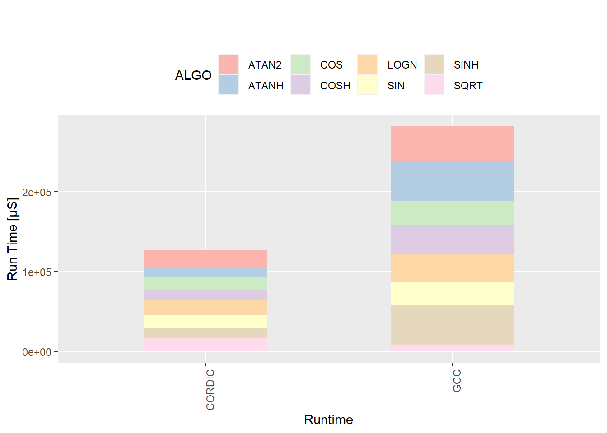
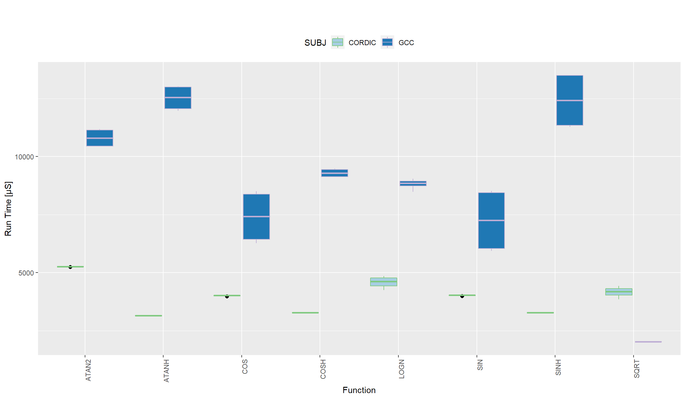
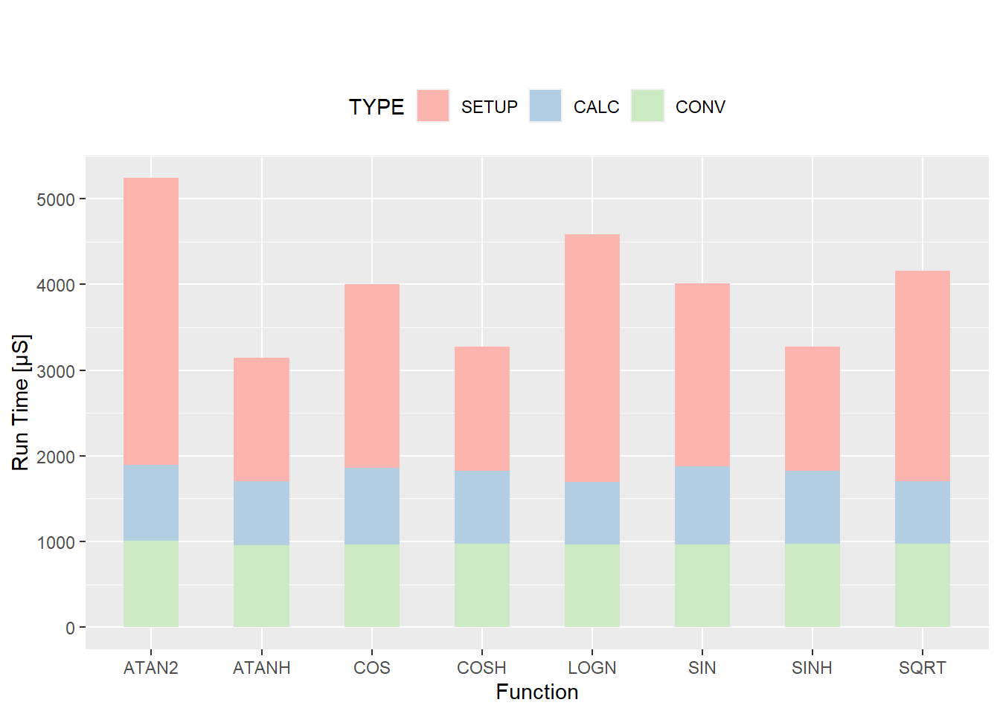

# Einleitung

Die Programmierung mit Mikrocontrollern wird immer anspruchsvoller, da diese immer mehr Komponenten erhalten.
Gleichzeitig hat sich dieser Bereich der Softwareentwicklung kaum weiterentwickelt, sodass Mikrocontroller weiterhin so programmiert werden,
wie es üblich war zu der Zeit, als diese wesentlich weniger komplex waren. C++ mit seinen Zero-Cost Abstractions bietet daher eine sehr gute Möglichkeit,
bestimmte Konzepte zu abstrahieren und somit die Entwicklung für Mikrocontroller nicht nur einfacher, sondern auch sicherer, zu gestalten.
Beispielhaft wurde ein Framework für die Verwendung von mehreren Komponenten für einen Mikrocontroller der STM32-Reihe entwickelt.
Dabei sollen zwei Komponenten des Mikrocontrollers mit den Mitteln von C++ modelliert werden.
Dafür werden zunächst die dem Framework zugrunde liegenden Konzepte gezeigt, um dann die Komponenten als solche zu implementieren.
Die zweite Komponente, eine sogenannte CORDIC-Einheit, ist eine spezielle Einheit innerhalb des hier verwendeten Modells des STM32.
Dieser kann einige trigonometrische Funktionen berechnen. Die Performance soll dann mit den bereits eingebauten trigonometrischen Funktionen verglichen werden.

# Beschreibung der Projektstruktur

Da es sich bei dem Projekt um ein Framework handelt, war es dass Ziel ein System zu nutzen, welche die Verwendung als solches ermöglicht.
Es ist ein Header-Only Framerwork, weswegen das System ein solches Unterstützen sollte.
Wichtige benötigte Features und Voraussetzungen sollten klar definierbar sein.
Daher wurde cmake verwendet, da es alle Anforderungen erfüllt und es die Verwendung des Frameworks vereinfacht.
Nachfolgend ist ein Teil der CMakeLists.txt gezeigt, welche Zentral für das Framework genutzt wird

~~~cmake
add_library(hal_lib INTERFACE)
target_include_directories(hal_lib INTERFACE .)

// ...

target_compile_features(hal_lib INTERFACE cxx_std_20 c_std_11)
~~~

Das Programm selbst, welches später die Benchmarks ausführen wird kann auf folgende Weise die Bibliothek verwenden.

~~~cmake
// ...
target_link_libraries(${PROJECT_NAME}.elf hal_lib)
// ...
~~~

Vorteil dieser Struktur ist, es dass ein Compiler festgelegt werden kann, welcher für die Kompilierung verwendet werden soll.
Zum Testen des Verhaltens einiger Klassen des Frameworks, konnten daher einige Tests geschrieben werden, welche auf dem Rechner ausgeführt werden können.
So konnte sichergestellt werden, dass das Verhalten der Klassen den Erwartungen entspricht.
Für die Verwendung eines Compilers wird eine Toolchain Datei definiert, diese beinhaltet Pfade zu den Compilern.

~~~cmake
set(CMAKE_SYSTEM_NAME Generic)
set(CMAKE_SYSTEM_PROCESSOR arm)
set(CMAKE_CROSSCOMPILING TRUE)

# specify cross compilers and tools
set(CMAKE_C_COMPILER arm-none-eabi-gcc)
set(CMAKE_CXX_COMPILER arm-none-eabi-g++)
set(CMAKE_ASM_COMPILER  arm-none-eabi-gcc)
set(CMAKE_AR arm-none-eabi-ar)
set(CMAKE_OBJCOPY arm-none-eabi-objcopy)
set(CMAKE_OBJDUMP arm-none-eabi-objdump)
set(CMAKE_LINKER arm-none-eabi-ld)
set(SIZE arm-none-eabi-size)

set(CMAKE_TRY_COMPILE_TARGET_TYPE_STATIC STATIC_LIBRARY)

set(CMAKE_C_FLAGS "${CMAKE_C_FLAGS} --specs=nosys.specs --specs=nano.specs -Os")
set(CMAKE_CXX_FLAGS "${CMAKE_CXX_FLAGS} --specs=nosys.specs --specs=nano.specs -Os")
~~~

So wird es auch möglich mithilfe einer anderen Toolchain Datei, andere Mikrocontroller zu verwenden.

# Die Ansteuerung der Peripherie

Oftmals wird die Peripherie von Mikrocontrollern, sowie bei dem vorliegenden STM32G4 über das Setzen von Bits in Registern, gesteuert.
Die Register befinden sich an bestimmten Stellen im Speicher des Mikrocontrollers.
Für das Setzen von Bits würde es genügen, einen Pointer mit dem richtigen Typ auf diesen Bereich zeigen zu lassen und dann die jeweils benötigten Bits zu setzen.
Eines der Ziele ist es jedoch neben der Typsicherheit eine Resistenz gegen Fehlverwendung herzustellen.
Mit dem Zeiger eines primitiven Datentypes auf das Register, können unsinnige Werte gesetzt werden.
Weiterhin gibt es oftmals in Registern Werte und Teile, die nicht manipuliert werden dürfen.
Um diese beiden Ziele zu erreichen, wurden eigene Datentypen implementiert. Diese werden im nachfolgenden Abschnitt näher erläutert.

## Beschreibung eines Registers

In der folgenden Abbildung ist die Beschreibung eines Registers des Mikrocontrollers abgebildet, wie sie in der Dokumentation des STM32G4 Mikrocontrollers vorkommt.
Die Beschreibung einzelner Bits besteht aus einer Funktion, einem Bereich und gültigen Werten.
Weiterhin wird bestimmt, ob es reservierte Bereiche gibt, welche nicht verändert werden dürfen.
Diese Zusammenhänge wurden in einem Datentyp modelliert.
Dieser Datentyp kann somit als Manifestation des Datenblattes verstanden werden.

~~~cpp
register_entry_desc<CR::DEDT, uint8_t, bit_range<16u, 20u>, access_mode::read_write>
~~~

Dieser Typ beschreibt die Bitpositionen von 16 bis einschließlich 20. Auf den Bereich kann lesend und schreibend zugegriffen werden.
Die Funktion des Bereichs wird mit einem enum Eintrag beschrieben.
So muss jedes einzelne Bit beschrieben werden. Ein Konzept stellt dies zur Kompilezeit sicher.
Diese überprüft weiterhin, dass sich die einzelnen Bereiche nicht überdecken, sodass Fehler beim Zugriff auf die einzelnen Bits ausgeschlossen werden können.
Für das UART Register CR ergibt sich damit folgender Typ. Dieser spiegelt die Beschreibung in Abbildung \ref{cr1} wieder.

~~~cpp
register_desc<
volatile uint32_t, register_entry_desc<CR::UE, bool, bit_pos<0u>>,
register_entry_desc<CR::UESM, bool, bit_pos<1u>>,
register_entry_desc<CR::RE, bool, bit_pos<2u>>,
register_entry_desc<CR::TE, bool, bit_pos<3u>>,
register_entry_desc<CR::IDLEIE, bool, bit_pos<4u>>,
register_entry_desc<CR::RXNEIE, bool, bit_pos<5u>>,
register_entry_desc<CR::TCIE, bool, bit_pos<6u>>,
register_entry_desc<CR::TXEIE, bool, bit_pos<7u>>,
register_entry_desc<CR::PEIE, bool, bit_pos<8u>>,
register_entry_desc<CR::PS, parity, bit_pos<9u>>,
register_entry_desc<CR::PCE, bool, bit_pos<10u>>,
register_entry_desc<CR::WAKE, bool, bit_pos<11u>>,
register_entry_desc<CR::M0, bool, bit_pos<12u>>,
register_entry_desc<CR::MME, bool, bit_pos<13u>>,
register_entry_desc<CR::CMIE, bool, bit_pos<14u>>,
register_entry_desc<CR::OVER8, bool, bit_pos<15u>>,
register_entry_desc<CR::DEDT, uint8_t, bit_range<16u, 20u>>,
register_entry_desc<CR::DEAT, uint8_t, bit_range<21u, 25u>>,
register_entry_desc<CR::RTOIE, bool, bit_pos<26u>>,
register_entry_desc<CR::EOBIE, bool, bit_pos<27u>>,
register_entry_desc<CR::M1, bool, bit_pos<28u>>,
register_entry_desc<CR::FIFOEN, bool, bit_pos<29u>>,
register_entry_desc<CR::RESERVED, reserved_type, bit_range<30u, 31u>>>
~~~

Auf diese Weise können auch Register modelliert werden, welche Werte akzeptieren, also keine Steuerungsregister sind.
Hier muss ebenfalls jedes einzelne Bit beschrieben werden.

~~~{.cpp}
register_desc<volatile uint32_t, register_entry_desc<0, uint8_t, bit_range<0u, 7u>>,
                          register_entry_desc<1, reserved_type, bit_range<8u, 31u>, access_mode::no_access>>
~~~

Bei diesem Register sind nur die ersten 8 Bits beschreibbar.
Der *reserved_type* ist ein Datentyp, welcher nicht angelegt werden kann. Er dient lediglich als Platzhalter.

## Platzierung eines Registers

Wie eingangs erwähnt, befinden sich die Register an bestimmten Stellen im Speicher.
Damit muss die vorherige gezeigte Beschreibung eines Register korrekt platziert werden.
Oftmals gibt es auch mehrere Register der selben Art, welche nur an anderen Positionen stehen.
Die Typen können daher mehrmals verwendet werden, um die verschiedenen Instanzen der Register zu bilden.
Dazu braucht man nur noch eine Lösung, die Register an die richtigen Stellen im Speicher zu platzieren.
Wie Eingangs erwähnt, sind Register bestimmte Stellen im Speicher. Damit muss die vorherige gezeigte Beschreibung eines Register korrekt platziert werden.
Oftmals gibt es auch mehrere Register der selben Art, welche nur an anderen Positionen stehen. Daher braucht man eine Lösung, die Register an die richtigen Stellen
im Code zu platzieren.

~~~{.cpp}
template<typename Component, auto N>
[[nodiscard]] constexpr inline auto address() {
    return reinterpret_cast<Component*>(Component::template address<N>::value);
}

template<typename Component, typename N>
[[nodiscard]] constexpr inline auto address() {
    return reinterpret_cast<Component*>(Component::template address<N>::value);
}
~~~

Die beiden Methoden werden anschließend mit der gewünschten Peripherie, oder hier Component genannt, mit dem entsprechenden Index parametrisiert.
Die Funktion greift dafür auf einen zuvor festgelegten Bereich zu und wandelt, diesen in den gewünschten Datentyp um.
Die Beschreibung dieser Zusammenhänge werden in structs gespeichert, welche den speziellen Mikrocontroller beschreiben. Diese werden in den nachfolgenden Abschnitten erläutert.

## Beschreibung des Mikrocontroller Aufbaus

<!-- TODO: Add Mikrocontroller Beschreibung hier -->

Die Beschreibung eines Mikrocontrollers ist die Anzahl und die Art seiner Komponenten.
Dies kann man mit einem Konzept implementieren, welches so die Peripherien eines Mikrocontrollers erfordern kann.
Diese Konzepts können dann in den einzelnen HAL-Schnittstellen verwendet werden.
So erfordert die GPIO Klasse, dass der Mikrocontroller einen bestimmten Aufbau aufweist.

~~~{.cpp }
    template<typename MCU, typename PIN>
    concept stm_mcu = requires(MCU::GPIO a) {
    typename MCU::GPIO::template address<PIN>;
    requires input_register_type<decltype(a.moder)>;
    requires input_register_type<decltype(a.otyper)>;
    requires input_register_type<decltype(a.ospeedr)>;
    requires input_register_type<decltype(a.pupdr)>;
    requires output_register_type<decltype(a.idr)>;
    requires input_register_type<decltype(a.bssr_set_io)>;
    requires input_register_type<decltype(a.bssr_clear_io)>;
    requires input_register_type<decltype(a.afr)>;
    requires input_register_type<decltype(a.moder)>;
};
~~~

Obiges Beispiel modelliert einen Mikrocontroller mit gpios. Damit kann sichergestellt werden, dass eine konkrete Implementierung für GPIOs vorliegt.
Diese Concepts werden im Zusammenhang mit dem HAL (Hardware-abstraction-layer) verwendet und verallgemeinert eine Implementierung für mehrere Mikrocontroller.

## Hardware Abstraction Layer

Die Komponenten eines Mikrocontrollers können meistens nicht gesondert verwendet werden, das bedeutet man braucht eine Komponente, um die andere zu verwenden.
Beispielsweise benötigt man Zugriff auf die GPIOs, um über UART kommunizieren zu können.
Diese Aufgabe, die einzelnen Komponenten zu abstrahieren, soll das Hardware Abstraction Layer (kurz HAL) erfüllen.
Nachfolgend werden die einzelnen Komponenten vorgestellt, die durch ein HAL beschrieben werden.

### GPIO

In diesem Abschnitt wird beschrieben, wie GPIOs in einem HALs implementiert wurden und wie deren Verwendung möglich ist.

Da ein Cortex M basierter Mikrocontroller im Gegensatz zu beispielsweise der relativ einfach aufgebauten Mircochip AVR Architektur relativ viele Möglichkeiten zur Ansteuerung und Konfiguration einzelner I/O-Pins sowie deren Register besitzt, wurde versucht, diese Komplexität möglichst einfach zu implementieren, indem so viel wie möglich Komplexität vor dem Nutzer versteckt wird.
Hierzu wurden zuerst, wie zuvor beschrieben, die einzelnen GPIO Register in einer STM32G4 spezifischen Klasse mittels `repeated_control_register` abgebildet. Dies ermöglicht ein fehlerfreies Einsetzen von Registerwerte mittels Enum-Werten. Zum Auslesen von Werten an GPIO Pins, wurde `data_register` verwendet, welches einen reinen Lesezugriff auf ein Register ermöglicht. Somit ist es auch einem Anwender möglich, mehrere Werte auf einmal auszulesen und auf diesen Bitoperationen auszuführen.

~~~cpp
 repeated_control_register<GPIO, MODER, uint32_t, 2> moder;
 data_register<GPIO, data_register_type::READ_ONLY, uint32_t, uint32_t{0xFFFF}> idr;
~~~

Da sämtliche GPIO Ports die gleiche Register Map besitzen ist es möglich, durch Austausch der Basisadresse diese auf die selbe Art anzusprechen, indem ein Struct auf den Registerspeicherbereich gemappt wird. Diese wurde mittels Template- Spezialisierung implementiert, wie nachfolgend zu sehen ist.

~~~cpp
template<>
struct mcu_info::GPIO::address<A> {
    static constexpr inline uintptr_t value = 0x48000000;
};
~~~

Der HAL der GPIOs besteht aus zwei Bestandteilen zum Referenzieren eines Pins, welche nachfolgend betrachtet werden können.

~~~cpp
// (1) Port A, Pin 1-3 an
gpio<mcu_ns::A, used_mcu>::on<1, 2, 3>();
// (2) Port A, Pin 3 aus
gpio<mcu_ns::A, used_mcu>::pin<3>::off();
~~~

Bei Methode 1 können mehrere Pins auf einmal angesprochen und Funktionen auf diesen ausgeführt werden. Dies erleichtert das gleichzeitige Ansteuern mehrerer Pins durch einen Benutzer.
Methode 2 wiederum ermöglicht das Ansteuern und Referenzieren eines einzelnen Pins. Diese Methode wird vor allem benutzt, um in speziellen Funktionen, wie beispielsweise UART, einzelne Pins für Senden und Empfangen festzulegen und somit die Lesbarkeit zu erhöhen, wie in nachfolgenden Kapiteln zu sehen ist.

Weitere Funktionen von GPIO umfassen bereits von AVR bekannte Fähigkeiten, wie beispielsweise den Pin Modus auf Ein- oder Ausgabe mittels `set_port_mode()` zu setzen, sowie das Auslesen eines Pins mittels `get()`. Zusätzlich zu diesen Methoden existiert noch unter ARM die Möglichkeit, einen Pin explizit auf Push/Pull oder Open Drain mittels `set_type()` zu stellen. Des weiteren ist es auch möglich, die Flankensteilheit mittels `set_speed()` zu setzen.

Zu beachten ist, dass zum Setzen und Leeren von Pin Outputs bei STM32 zwei verschiedene Möglichkeiten bestehen. Erstere ist mittels des ODR Registers möglich, welches sowohl das Lesen als auch das Schreiben unterstützt. Diese Methode ist jedoch nicht atomar. Jedoch wird hierbei das gleichzeitige Setzen und das Löschen über den selben Eintrag ermöglicht. Die zweite Methode ist mittels BSRR Register. Hierbei sind lesen und schreiben in unterschiedliche Einträge getrennt und diese Operation wird auch atomar ausgeführt. In diesem Projekt wurde sich für BSRR entschieden, da dies eine erhöhte Nutzungssicherheit bietet und eventuelle Fehlbenutzungen leichter auffallen.

Eine Besonderheit der GPIO Register, welche noch beachtet werden musste ist, dass ein großer Teil der Pins eine eigene alternative Funktion besitzen kann. Beim Setzen dieser Funktion wird mittels eines Multiplexers am Pin des Mikrocontrollers dieser mit einer speziellen Funktion verbunden. Dies ist vor allem notwendig, wenn UART oder andere Funktionen am Ausgang eines Pins verwendet werden müssen.
Da diese Funktionen sich jedoch von Mikrocontroller zu Mikrocontroller unterscheiden können und auch innerhalb der Modellreihe sich unterscheiden, muss hierzu eine Spezialisierung der jeweiligen verfügbaren Mikrocontroller durchgeführt werden. Hierzu wurde die Klasse `g474re` hinzugefügt, welche die Mappings der alternativen Funktion mit der jeweiligen Zahl dieser Funktion durchführt. Ein Beispiel hierzu kann nachfolgend gesehen werden

~~~cpp
type_mapper mapper{
    type_value_pair<af_type<A, 2, uart_nr::two, uart::uart_pin_types::TX>, af_name::AF7>{},
    type_value_pair<af_type<A, 3, uart_nr::two, uart::uart_pin_types::RX>, af_name::AF7>{}
}
~~~

Hierbei werden die TX und RX Pins von UART der Funktion 7 zugewiesen.
Anschließend kann mittels der Funktion find_af, welche für jede Spezialisierung eines Mikrocontrollers existiert, nach dessen Abbildungen gesucht werden.
Somit können die alternative Funktionen und deren konkrete Werte abstrahiert werden.

Anschließend kann mittels der Funktion find_af, welche für jede spezialisierte Mikrocontrollerklasse existiert, nach diesen Mappings gesucht und somit diese abstrahiert werden.

~~~cpp
template<typename Port, uint32_t pin, typename function_number, auto function_type>
requires(pin <= 31) static constexpr af_type find_af() {
    return detail::mapper.lookup_type<detail::af_type<Port, pin, function_number, function_type>>();
}
~~~

Im HAL wurden diese Mappings innerhalb der Funktion `set_alternative_function()` verwendet um mittels der Pin Informationen, welche bereits innerhalb der Klasse verfügbar sind, sowie der Funktionsbeschreibung (wie UART2) die zugehörige alternative Funktion zu finden und entsprechend ansprechen zu können, wie dies im nachfolgenden Beispiel zu sehen ist.

~~~cpp
gpio<mcu_ns::A, used_mcu>::pin<3>::set_alternative_function<uart_nr::one, uart_pin_types::TX>();
~~~

### UART

In diesem Abschnitt wird die Abstraktion der UART Funktionalität beschrieben.
Diese dient der Kommunikation eines Mikrocontrollers mit einem externen Gerät.
Die in diesem Projekt verwendete STM32G4 Serie besitzt zwei verschiedene UART Implementierungen.
Bei der ersten Variante Handelt es sich um einen "universal synchronous/asynchronous receiver transmitter".
Dieser besitzt sowohl die Möglichkeit der synchronen, als auch der asynchronen Übertragung.
Des Weiteren existiert neben dieser Variante auch die Möglichkeit die Kommunikation im Low-power Modus durchzuführen.
Diese Variante ist als LPUART verfügbar.
In diesem Projekt wurde zunächst nur die Möglichkeit der asynchronen UART Übertragung für den HAL zur Verfügung gestellt.
Jedoch wäre es mit minimalen Anpassungen ebenfalls möglich, die LPUART Variante mit ähnlicher Funktionalität wie der, der UART Alternative, zu implementieren.

Die in diesem Projekt verwendete STM32G4 Serie besitzt zwei verschiedene UART Implementierungen. Bei der ersten Variante handelt es sich um einen "universal synchronous/asynchronous receiver
transmitter". Dieser besitzt sowohl die Möglichkeit der synchronen als auch asynchronen Übertragung. Des Weiteren existiert neben dieser Variante auch die Möglichkeit einer Kommunikation im Low-power Modus, welcher als LPUART verfügbar ist. In diesem Projekt wurde nur die Möglichkeit der asynchronen UART Übertragung für den HAL zur Verfügung gestellt. Jedoch wäre es mit minimalen Anpassungen auch möglich, die LPUART Variante mit ähnlicher Funktionalität wie UART zu implementieren.

Als erster Schritt bei der Implementierung des Hal muss die Taktleitung von dem zugehörigen GPIO Port, wie auch die des UART-Moduls, aktiviert werden. Hierzu wird die Klasse mcu_features verwendet, welche die jeweiligen Clock zu Funktions mappings besitzt. Ein Aufruf zum aktivieren der Clock kann im nachfolgenden Codebeispiel gesehen werden:

~~~cpp
mcu_features<MCU>::template enable_clock<features::hal_features::UART, UartNr>();
~~~

Ein weiterer Schritt zum Aktivieren von UART ist die Konfiguration der jeweiligen Pins. Zur konkreten Implementierung wurden hierbei die HAL Funktionen des vorherigen Kapitels verwendet.
Zum Erstellen des HALs wurden die zuvor beschriebenen GPIO Pin Abstrahierungen verwendet, um sich möglichst einfach auf Veränderungen an der zugrundeliegende Hardware anzupassen. So wurden unter anderem die alternativen Funktionen auf UART gesetzt und die Pins in Push/Pull Konfiguration versetzt.

Anschließend können die jeweiligen UART Register konfiguriert werden. Diese existieren bereits in der Registerbeschreibung der jeweiligen Mikrocontroller und werden in dieser Funktion für den Benutzer konfiguriert. Die möglichen Optionen für den Benutzer sind hierbei die Auswahl der Baudrate sowie die Anzahl an Daten und Stoppbits. UART der STM32G4-Reihe umfasst noch deutlich mehr Optionen zur Konfiguration, jedoch wurden weitere Optionen aufgrund der steigenden Benutzungskomplexität ausgelassen.

Ein Aufruf zur UART Initialisierung ist nachfolgend beispielhaft gezeigt.

~~~cpp
uart_two::init<txpin, rxpin, 115200_baud>();
~~~

Die Ausgabe mittels UART kann mit einer an printf angelehnten Funktion durchgeführt werden.
Weiterhin wird diese Methode mit der Größe des Ausgabepuffers parameterisiert, um zum einen dynamisch allokierten Speicher zu verhindern,
als auch dem Nutzer die Möglichkeit zu geben, den Puffer je nach Bedarf vergrößern zu können.
Diese benutzt intern `snprintf` und schreibt die einzelnen Zeichen nacheinander in das UART Ausgabe Register.
Abschließend ein kurzes Beispiel, wie die Ausgabe erfolgen kann.

~~~cpp
uart_two::printf<256>("quadrant : %d \r\n", i);
~~~

### CORDIC

Die Cordic Abstraktion ist als template implementiert. Dieses wird mit der Nummer der CORDIC und dem Typ des Mikrocontrollers parameterisiert.
Der Mikrocontroller, welcher Gegenstand dieses Konzepts ist, besitzt lediglich einen CORDIC.
Die Implementierung der CORDIC Abstraktion nimmt jeweils einen Datentyp entgegen, der einer Operation entspricht.
Dieser Typ hat hier jeweils einen Typ, welcher das Ergebnis enthält. Anhand von der übergebenen Operation und den template Parametern, werden die Register
des CORDICs gesetzt. Aus dem Operationstyp werden hierbei die Funktion, sowie die Anzahl der Argumente übernommen.
Weitere Einstellungen werden aus dem weiteren Kontext her abgeleitet.
Jeder Operationsdatentyp definiert seinen Argumentdatentyp. Dieser leitet sich von den Anforderungen des CORDICs an das Argument ab.

~~~cpp
struct sqrt_scales {
    static inline constexpr std::array ranges{
        Detail::range{.upper_bound = 0.75f - std::numeric_limits<float>::min(), .lower_bound = 0.027f, .scale = 0},
        Detail::range{.upper_bound = 1.75f - std::numeric_limits<float>::min(), .lower_bound = 0.75f, .scale = 1},
        Detail::range{.upper_bound = 2.341f, .lower_bound = 1.75f, .scale = 2}};
    // ...
};
~~~

Hier wird beispielhaft für die anderen Datentypen die benötigten Skalierungen für die Wurzel Funktion gezeigt.
Die Skalierung wird benötigt um das Interval des q_number Types zu erweitern, um somit einen größeren Definitionsbereich zu erhalten.
Diese kommt auch bei anderen Funktionen zum Tragen wie beispielsweise, der logn Funktion.

~~~cpp
template<typename Config>
struct create_op_helper<Config, functions::square_root> {
    using argument_type = typename Config::scaled_qtype<sqrt_scales>;

    using type =
        general_operation<Config, operation_type::single, functions::square_root,
                          general_operation_args<argument_type>, general_operation_res<typename Config::qtype>>;

    static inline constexpr auto create() { return type{}; }
};

template<typename Config, functions Function>
    static inline constexpr auto create_cordic_operation() {
        return create_op_helper<Config, Function>::create();
}
~~~

Das struct *create_op_helper ist für die Erstellung der einzelnen Funktionen zuständig. Dieser wird für die einzelnen Funktionen spezialisiert.
Damit bildet die Funktion *create_cordic_operation* eine Fabrikmethode, womit die spezielle Operation einheitlich erstellt werden kann.
Warum eine Typisierung wichtig ist, bei der Vermeidung von Fehlern kann beispielhaft an der atan2 Methode gezeigt werden.
Atan2 benötigt einen 2-Dimensionalen Vektor als Eingabe, dies wird in der entsprechenden CORDIC operation auch so modelliert:

~~~cpp
//...
cordic_benchmark_values[i].arg1(typename CordicOpType::args_type::first_arg_type(
                x_coord{0.5f}, y_coord{0.5f}));
// Alternativ auch:
cordic_benchmark_values[i].arg1(typename CordicOpType::args_type::first_arg_type(
                0.5_x, 0.5_y));
//...
~~~

Durch die Verwendung von den beiden Datentypen *x_coord* und *y_coord*, kann eine Verwechslung durch den Nutzer vermieden werden.
Dieses Problem existiert in der Implementierung der atan2 Funktion:

~~~cpp
float atan2(float y, float x);
~~~

Hierbei muss der Nutzer die Reihenfolge der Argumente beachten und erhält keine Hilfestellung durch den Compiler, weswegen eine Verwechslung oftmals unbemerkt bleibt.

# CORDIC

In folgendem Abschnitt wird zunächst die konkrete Implementierung vorgestellt, welche die CORDIC Einheit ansteuert.
Danach wird die Performance dieser Einheit mit den in gcc eingebauten trigonometrischen Funktionen verglichen.

## Konkrete Implementierung der Cordicverwendung und zugehörige Datentypen

Wie eingangs erwähnt liegt die Stärke von C++ vor allem in den Zero-Cost-Abstractions, welche eine Typsicherheit herstellen.
Für die CORDIC Komponente wurden deswegen eigene Datentypen entworfen, die dies bieten können.
Die CORDIC Komponente wird benutzt, indem man die gewünschte Einstellungen im Kontrollregister vornimmt,
dann je nach Anzahl von Argumenten diese nacheinander in die Argumentregister schreibt.
Nachdem der Algorithmus durchlaufen ist, werden die Ergebnisse je nach Anzahl wieder ausgelesen.
Die Werte, welche in das Argumentregister geschrieben werden und die Ergebnisse, welche man aus dem Ergebnisregister erhält sind keine Werte, welche man direkt verwenden kann.
Sie sind in einem Festkomma Format, dabei gibt es zwei Varianten *q1_31* und *q1_15*.
Die Zahlen bewegen sich somit in einem Interval zwischen -1.0 und 1.0.  Größere Werte müssen durch die Software skaliert werden.
Auch haben einige Funktionen unterschiedliche Definitionsbereiche, so müssen diese ebenfalls in den Datentyp miteinbezogen werden.

## Zeitmessung und Vergleich mit eingebauten trigonometrischen Funktionen

Im Folgenden wir die Performance des CORDIC verglichen mit der der eingebauten trigonometrischen Funktionen.
Zunächst wird das Setup zum Messen beschrieben um dann im nachfolgenden Teil die Ergebnisse auszuwerten.

### Konfiguration der Hardware

Die Messung der Timings benötigen auf der Hardwareebene nur wenig Konfigurationsoptionen, da nur ein Durchgäniger Zähler benötigt wird um eine Zeitdifferenz zu ermitteln.
Aus diesem Grund wurde im Setup des Timers mit direktzugriffen auf die Hardware gearbeitet.
Zuerst wurde hierbei ein Taktsignal auf den Timerbus angelegt um diesen später aktivieren zu können.
Anschließend musste der Timer zurückgesetzt werden um Mögliche vorherige Konfigurationen zu entfernen und diesen zu stoppen.
Als Taktrate des Timers wurde 1Mhz verwendet, was bedeutet das ein Zyklus des Timers mit einer Mikrosekunde gleichzusetzen ist.
Zudem musste der Maximalwert des Timer Counters im ARR Register auf den höchstmöglichen Wert gesetzt werden, welcher bei der vorliegenden STM32G4 Reihe 0xFFFFF, oder in Dezimal 1.048.575, entspricht.
Dies hat zur Folge, dass die maximal erfassbare Dauer einer Zeitmessung 1 Sekunde, 48 Millisekunden und 575 Mikrosekunden beträgt.
Diese Optionen waren nötig um den Timer zu Konfigurieren und anschließend ist das starten des Timers möglich.

Zum zurücksetzen des Timers wurde der Timerwert in dem Register auf 0 gesetzt, der Timer läuft zu diesem Zeitpunkt jedoch weiter und wird nicht angehalten.
Das Auslesen des Wertes erfolgt über den Zugriff auf das counter register welches als Kopier erfolgt um versehentliches überschreiben zu vermeiden. Der Maximalwert dieses Registers entspricht dem Wert von ARR

### Setup

Die benötigte Zeit für Berechnungen wird mithilfe eines Timers gemessen. Zum Start der Berechnungen wird dieser zurückgesetzt und am Ende wird er ausgelesen.
Für solche Zwecke eignet sich sehr gut eine Klasse, welche nach dem RAII Konzept arbeitet. Dazu wird die Methode für das Zurücksetzen der Zeit im Konstruktur der Klasse ausgerufen.
Der Destruktor wiederum speichert den zurückgelieferten Wert des Timers in einem übergebenen Pointer.

~~~.cpp
using setup_benchmark_type = benchmark<decltype(&reset_counter), decltype(&get_counter_value)>;
setup_benchmark_type b(reset_counter, get_counter_value);
uint32_t result = 0;
{
    auto probe = b.create_probe<benchmark_name>(&result);
    // Do calculations

    // Probe destructor is called at the end of the block
}

// result has now the value of the timer in it
~~~

Der Vergleich zwischen CORDIC und den eingebauten trigonometrischen Funktionen soll zunächst davon ausgehen, dass man mit Fließkommazahlen rechnen möchte.
Zum besseren Überblick werden die Zeiten, welche für die Berechnungen mit dem CORDIC benötigt werden, in drei Teile unterteilt:

- Dem Berechnen der Eingaben, also der Umrechnung von den Fließkommazahlen in den jeweiligen Typ
- Der eigentlichen Berechnung mit der CORDIC Einheit
- Dem Umrechnen der Ergebnisse in eine Fließkommazahl

### Auswertung der Ergebnisse

Die Performance des CORDIC ist unabhängig von der Eingabe, lediglich die geforderte Präzision beeinträchtigt die benötigte Berechnung.

Basierend auf den Daten aus dem Datenblatt des Mikrocontrollers kann davon ausgegangen werden, dass die einzelnen Funktionen sich kaum in ihrer Ausführungszeit
unterscheiden. Lediglich die verschiedene Implementation der Funktionen in der Software, also das Beschreiben der Argumentregister und das Auslesen der
Ergebnisregister kann Unterschiede in der Performance nach sich ziehen.
Diese Vermutung wird später gesondert überprüft.

Summiert man alle Zeitmessungen der verschiedenen Funktionen zusammen, sieht man, dass der CORDIC insgesamt deutlich schneller war, als die eingebauten
trigonometrischen Funktionen von gcc.

Bei den eingebauten trigonometrischen Funktionen des Compilers hat die Größe der Eingabe einen Einfluss. Erkennbar ist dies an der größeren Varianz der
Laufzeit des GCC. Hier lässt sich erahnen, welche Methoden wenig selbst berechnen müssen.
Die kleinen Unterschiede bei den verschiedenen Funktionen des Cordics könnten durch die verschiedenen Anzahlen von Argumenten erklärt werden, die die einzelnen Funktionen benötigen.
In der nachfolgenden Abbildung ist, die Zeitmessung des CORDICs aufgeteilt auf die einzelnen Aspekte der Berechnung.
Dabei setzt sich die Berechnung wie folgt zusammen:

* SETUP: Das Erstellen und Setzen der Argumente, beispielsweise das Umrechnen einer Gleitkommaeingabe in den verwendeten Argumenttyp
* CALC: Stellt die eigentliche Berechnung des CORDICs dar, hierbei werden auch die Argumente in das Argumentregister geschrieben
* CONV: Bildet das Auslesen der Resultate und das Umwandeln in einen Gleitkommatyp

Die Abbildung bestätigt die vorangegangen Vermutungen.
Die Berechnungen des CORDICs selbst, sind nahezu identisch, da die Berechnungszeit über die Präzision bestimmt wird.
Auch die benötigte Zeit für die Umwandlung des Ergebnisses ist identisch, da bei allen genannten Funktionen nur ein zu berechnendes Ergebnis verwendet und ausgelesen wird.
Lediglich die Anzahl der Argumente hat eine wesentliche Auswirkung auf die benötigte Zeit.
Manche Werte müssen skaliert werden und dies benötigt ebenfalls ein wenig Zeit, da überprüft werden muss, in welchem Bereich die jeweilige Zahl liegt.
Sichtbar wird dies vor allem bei den beiden Funktionen *logn* und *sqrt*, welche beide eine relativ hohe Varianz haben, wenn man sie mit den restlichen Funktionen vergleicht.
Diese haben einen größeren Eingabebereich, weswegen mehr Skalierungen notwendig sind, um diesen Bereich auf den verwendeten Datentyp abzubilden.
Auch die Funktion atan2 benötigt mehr Zeit für die Beschreibung seiner Argumente, dies liegt darin begründet, dass atan2 als einzige Funktion 2 Argumente in Form eines Vektors benötigt.

### Bewertung der Ergebnisse

Wenn mit Ergebnissen der Funktionen des CORDICs weitergerechnet werden kann, verbessert sich die Performance noch mehr.
Denn die in Relation gesehene, teure Umwandlung von Gleitkommazahlen kann dadurch gespart werden.
Weiterhin sollte bedacht werden, dass die einzelnen Funktionen oftmals mehrere Ergebnisse liefern, kann also bei einer
das zweite Ergebnis genutzt werden, verdoppelt sich der Nutzen der CORDIC Funktionen praktisch.

# Fazit

Es konnte gezeigt werden, dass C++ gut verwendet werden kann, um typsichere und effiziente Abstraktionen zu erstellen, die die Komplexität bei der Verwendung von Mikrocontrollern mindern kann.
Dabei können nicht nur die  Abstraktionslayer selbständig genutzt werden, sondern diese können ebenfalls zur Erstellung weiterer Abstraktionen verwendet werden.
Dadurch vermindert sich die weitere Entwicklungszeit, immer wieder auf bereits implementierte Abstraktionen zurückgegriffen werden kann.

## Ausblick

Durch den weiteren Ausbau des Frameworks können weitere Peripherien des Mikrocontrollers typsicher und einfach verwendet werden.
Zudem könnte dieses Framework auf andere Mikrocontroller portiert werden, sodass man eine gemeinsame Schnittstelle verwenden kann.
Dadurch entfällt ein großer Teil der Komplexität bei der Entwicklung von Mikrocontrollern, da der Nutzer nicht mehr die Eigenheiten kennen muss.
Es können weitere Operationen für die q_number Klasse hinzugefügt werden, sodass die etwas teure Umwandlung von Fließkommazahlen in Fixed-Kommazahlen
erspart bleibt und man stattdessen mit diesem Typen weiter rechnen kann.
Weiterhin könnte die CORDIC-Einheit im Pipeline Modus gut mit dem ranges feature von C++20 verbunden werden, denn dann kann eine gewohnte API auch für die CORDIC Einheit verwendet werden.
Abschließend kann gesagt werden, dass die Verwendung von C++ auf Mikrocontrollern sinnvoll ist, da die Entwicklung vereinfacht wird und häufige Fehler durch
C++ Features, wie beispielsweise Konzepts bereits zur Kompilezeit aufgedeckt werden können.
Somit kann ein gewisser Grad von Korrektheit für das Programm sichergestellt werden, wenn es kompiliert werden kann.

\newpage
